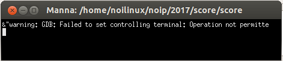
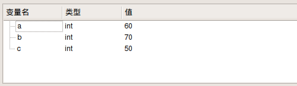
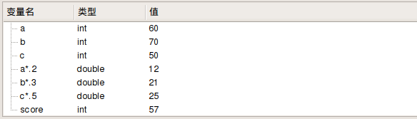

# noilinux-1.4.1下GUIDE-1.0.0解题过程说明

- 张大为
- 辽宁师范大学计算机与信息技术学院@大连
- [https://daweizh.github.io/noip/](https://daweizh.github.io/noip/)  QQ:1243605845

本说明以 NOIP 2017年第23届普及组 复赛试题score为例，讲解上机答题的基本过程。

## step1 准备可提交的最小程序框架

以score1.ans作为输出内容，建立最小可提交程序框架。

~~~cpp
#include <stdio.h>
#include <iostream>
using namespace std;

int main(){
    freopen("score.in","r",stdin);
    freopen("score.out","w",stdout);

    cout << 40 << endl;

    return 0;
}
~~~

1. **Ctrl+s**，将上述代码以文件名**score.cpp**保存到与测试数据相同的**score**文件夹下
2. **Ctrl+F5**运行，出现如下终端窗口   
       
	**注意：该窗口一定要关闭，否则GUIDE无法响应任何操作**
3. 点击，查看score.out文件内容是否正确
	~~~cpp
	40
	~~~

## step2 编写对拍程序测试提交代码

针对给定的测试用例，只有通过对拍程序得到Ac才能确定所提交代码可以得分。
编写如下对拍程序，命名为**score.sh**，保存到与**score.cpp**相同的**score**文件夹下。

~~~sh
#!/bin/bash
i=1
while [ $i -le 10 ]
do
    echo score$i
    cp -f score$i.in score.in
    ./score
    if diff score$i.ans score.out ; then
        echo Ac
    fi
    i=$(($i+1))
done
~~~

在终端窗口键入如下命令并执行上述对拍程序

~~~sh
$ cd ~/noip/2017/score/
$ sh ./score.sh 
score1
Ac
score2
1c1
< 50
---
> 40
score3
1c1
< 10
---
> 40
score4
1c1
< 65
---
> 40
score5
1c1
< 70
---
> 40
score6
1c1
< 55
---
> 40
score7
1c1
< 37
---
> 40
score8
1c1
< 46
---
> 40
score9
1c1
< 56
---
> 40
score10
1c1
< 58
---
> 40
~~~

发现上述结果中只有一个Ac，根据该测试点分值，可得10分。

## step3 读取输入数据

综合分析试题描述对数据建模，找到基本的输入输出数据存储方式，并确定它们的数据类型。

根据试题描述，用a保存作业成绩，用b保存小测成绩，用c保存期末考试成绩，用score保存总成绩。由于需要计算成绩的只有牛牛，确定数据的读入策略为**一次性读入**。

~~~cpp
#include <stdio.h>
#include <iostream>
using namespace std;

int a,b,c,score;

int main(){
    freopen("score.in","r",stdin);
    freopen("score.out","w",stdout);

	cin >> a >> b >> c;
	
    cout << 40 << endl;

    return 0;
}
~~~

按**F7**编译通过上述程序，将输入光标放在`cout << 40 << endl;`行首，按**F9**键设置断点，按**F5**键开始调试，出现如下终端窗口

**注意：一定在调试结束时关闭该窗口，否则GUIDE不响应任何操作**。在调试状态下，点击**信息查看栏** 右下的**变量查看** ，点击按钮依次增加变量**a** ，**b** 和**c** ，并观察其**类型**和**值**，如下图所示。

调试结束后关闭**调试终端窗口**，按**F9**键去除断点标记。

## step4 调试并发现程序中的问题

根据试题中给出的计算总成绩的方法，确定数据加工方法（算法）。

~~~cpp
score = a*0.2 + b*0.3 + c*0.5; 
~~~

其中，**20%=2/10=0.2，30%=3/10=0.3，50%=5/10=0.5**，完整程序如下：

~~~cpp
#include <stdio.h>
#include <iostream>
using namespace std;

int a,b,c,score;

int main(){
    freopen("score.in","r",stdin);
    freopen("score.out","w",stdout);

	cin >> a >> b >> c;
	score = a*0.2 + b*0.3 + c*0.5;
	
    cout << score << endl;

    return 0;
}
~~~

按**F7**重新编译通过，然后运行对拍程序，观察测试点通过情况。

~~~sh
score1
Ac
score2
Ac
score3
Ac
score4
Ac
score5
Ac
score6
Ac
score7
1c1
< 37
---
> 36
score8
1c1
< 46
---
> 45
score9
1c1
< 56
---
> 55
score10
1c1
< 58
---
> 57
~~~

发现后4个测试点并未通过，而且输出结果与答案值相差1。问题出在哪了？再次设置断点，观察`a*0.2`，`b*0.3`，`c*0.5`和`score`的类型和值。

通过上图发现`a*0.2`，`b*0.3`和`c*0.5`的类型为`double`，而`score`的类型是`int`，这样需要在`double`和`int`类型之间进行转换，而且由`double`向`int`类型转换时可能存在着精度损失。

## step5 改用全整数运算

既然使用整数和小数的混合计算会发生数据类型转换，那能不能进行全`int`型计算呢？下面就是一种方法

~~~cpp
score = (a*20 + b*30 +ｃ＊50) /100;
~~~

完整的程序如下

~~~cpp
#include <stdio.h>
#include <iostream>
using namespace std;

int a,b,c,score;

int main(){
    freopen("score.in","r",stdin);
    freopen("score.out","w",stdout);

	cin >> a >> b >> c;
	score = (a*20 + b*30 + c*50)/100;
	
    cout << score << endl;

    return 0;
}
~~~

再次运行对拍程序，观察结果如下：

~~~sh
score1
Ac
score2
Ac
score3
Ac
score4
Ac
score5
Ac
score6
Ac
score7
Ac
score8
Ac
score9
Ac
score10
Ac
~~~

所有测试数据全部通过。

## step6 直接计算并输出

避免数据类型强制转换，可以直接输出计算结果，程序如下

~~~cpp
#include <stdio.h>
#include <iostream>
using namespace std;

int a,b,c,score;

int main(){
    freopen("score.in","r",stdin);
    freopen("score.out","w",stdout);

	cin >> a >> b >> c;
	
    cout << a*.2 + b*.3 + c*.5 << endl;

    return 0;
}
~~~

重新执行对拍程序，结果如下

~~~sh
score1
Ac
score2
Ac
score3
Ac
score4
Ac
score5
Ac
score6
Ac
score7
Ac
score8
Ac
score9
Ac
score10
Ac
~~~

## step7 总成绩采用浮点型 

为避免类型转换过程中的精度损失，可用`double`定义总成绩`score`变量，程序如下：

~~~cpp
#include <stdio.h>
#include <iostream>
using namespace std;

int a,b,c;
double score;

int main(){
    freopen("score.in","r",stdin);
    freopen("score.out","w",stdout);

	cin >> a >> b >> c;
	score = a*.2 + b*.3 + c*.5;
    cout << score << endl;

    return 0;
}
~~~

执行对拍程序，结果如下：

~~~sh
score1
Ac
score2
Ac
score3
Ac
score4
Ac
score5
Ac
score6
Ac
score7
Ac
score8
Ac
score9
Ac
score10
Ac
~~~

## w.微信订阅号

1. 智数精英-关注中小学程序设计及相关讨论
2. 随话录-记录小朋友们的成长时光
2. 西山征途-关注大学生成长、学习和生活

----------

## b.[返回首页](../../)
	
	
