# noilinux-1.4.1下Arbiter使用说明

- 张大为 QQ:1243605845 @大连
- 辽宁师范大学计算机与信息技术学院
- [https://daweizh.github.io/noip/](https://daweizh.github.io/noip/)  

本说明以 NOIP 2017年第23届普及组复赛为例，
讲解随noilinux-1.4.1安装的Arbiter评测系统单机版的使用方法。

## step1 新建测评

1. 在**主文件夹**下创建文件夹**arbiter** ，在**arbiter** 文件夹下创建文件夹**2017** 。
	~~~
	/home/noilinux/arbiter/
	└── 2017
	~~~
2. 选择**应用程序** -> **编程** -> **Arbiter评测系统** 打开Arbiter评测系统。   
	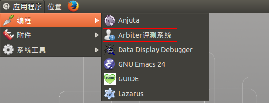
3. 点击窗口下方**NEW**按钮    
	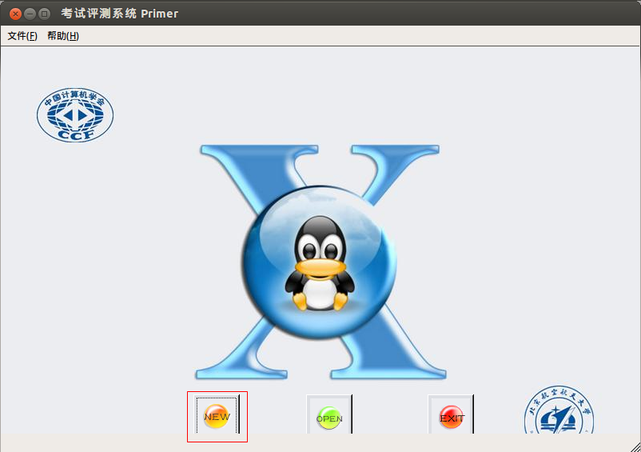
4. 新建比赛    
	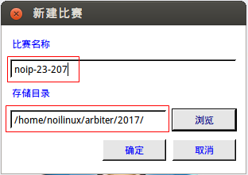
	- 输入比赛名称**noip-23-2017**
	- 选择准备好的竞赛目录**/home/noilinux/arbiter/2017/**
	- 点击确定

## step2 添加考试

1. 鼠标右击**试题概要** 下方的空白处，点击**添加考试**    
	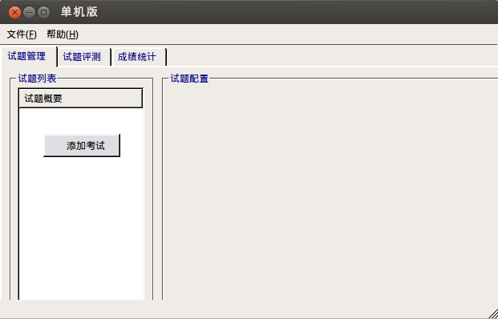
2. 鼠标右击**第1场--机试** ，点击**添加试题**   
	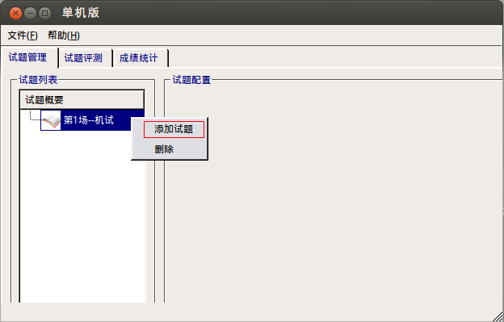
3. 完善考试数据    
	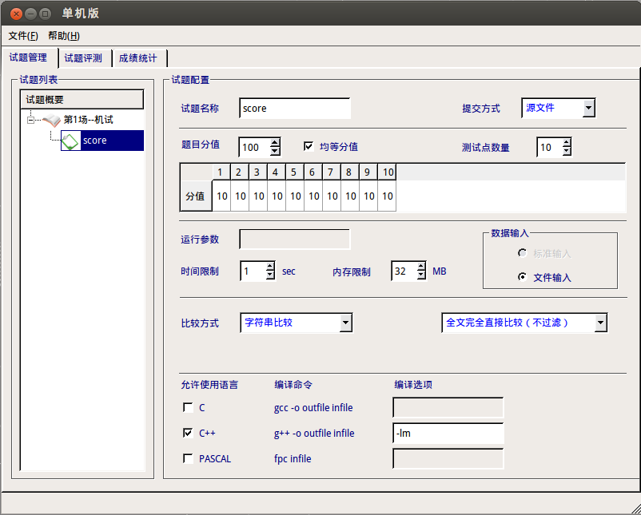
	- 修改试题名称为**score**
	- 修改**测试点数量**与实际测试点相符
	- 比较方式选择**字符串比较**和**全文完全直接比较（不过滤）**
	- 保留**C++**勾选，按题目要求填写编译选项为**-lm**
4. 添加试题librarian    
	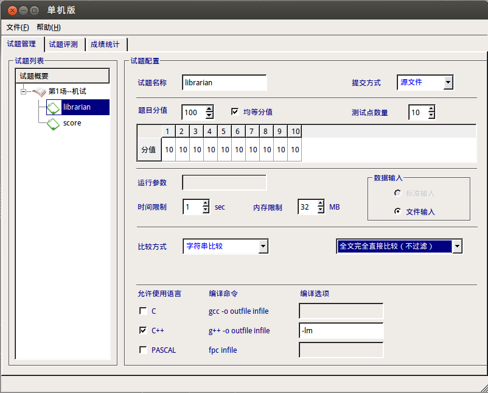
5. 添加试题chess    
	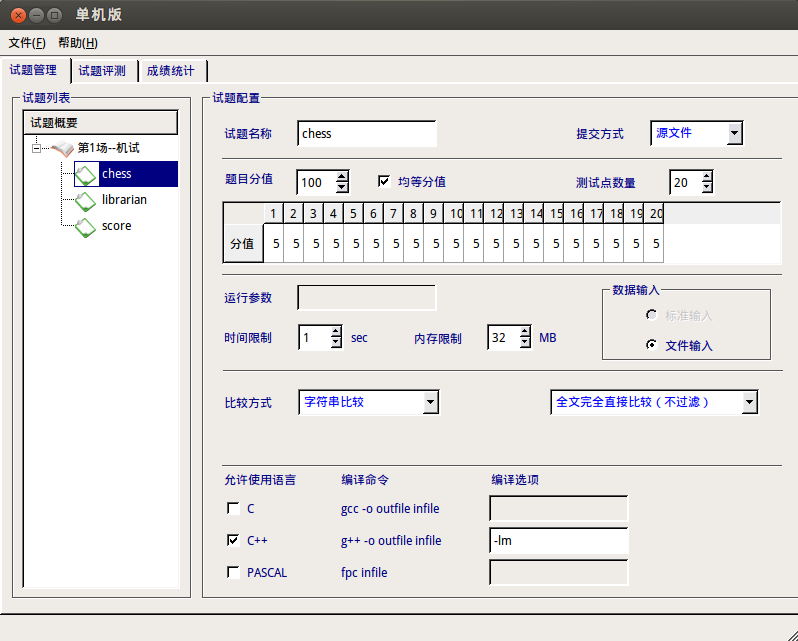
6. 添加试题jump     
	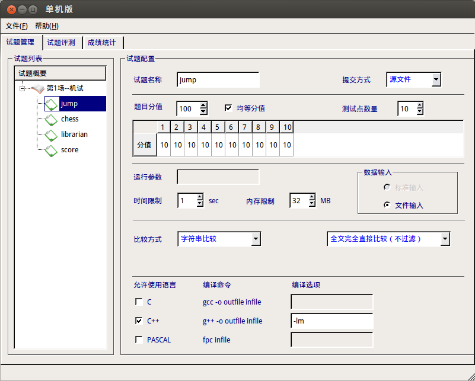
7. 点击**第1场--机试**，浏览试题列表    
	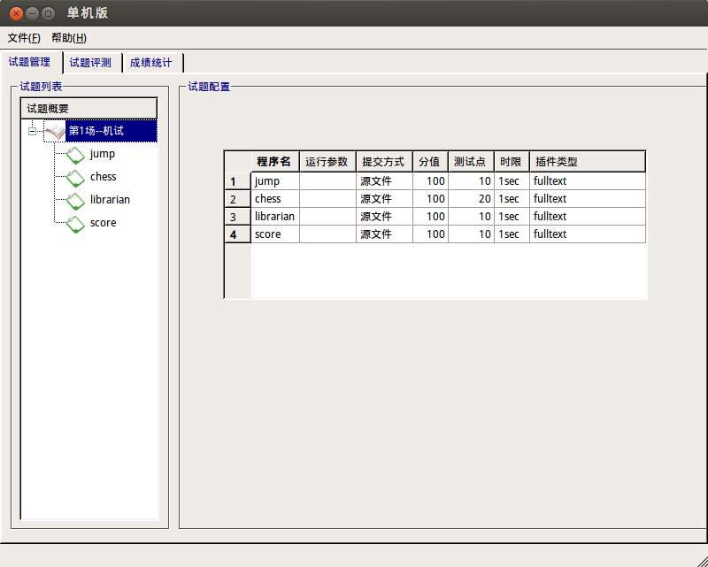

## step3 添加选手

1. 选择**试题评测** -> **添加选手**    
	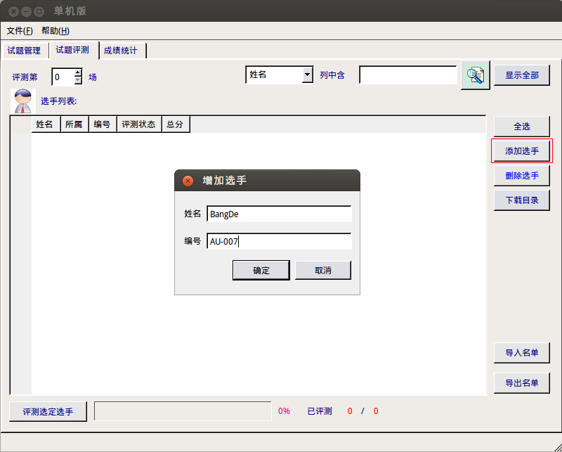
	- 姓名输入自己的英文名BangDe
	- 编号为自己的考号AU-007
	- 点击确定
2. 选择**第1场评测** ，在选手列表中出现待评测试题    
	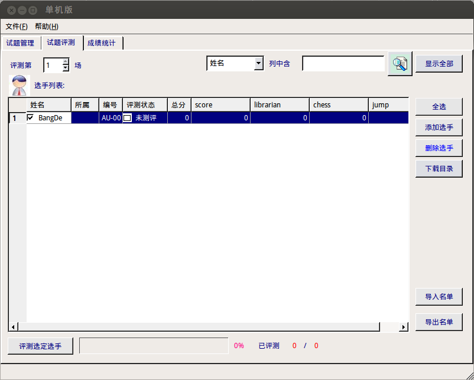
3. 选择**文件**，**保存**，建立并保存Arbiter的基本配置及相关数据，关闭Arbiter
	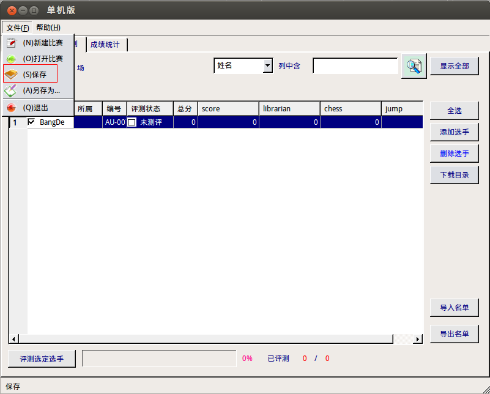

## step4 准备评测数据

1. 打开**主文件夹/arbiter/2017**文件夹    
	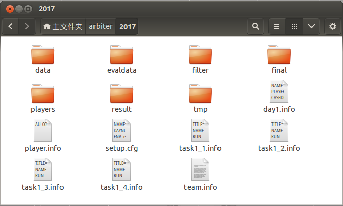
2. evaldata 存放本考试数据    
	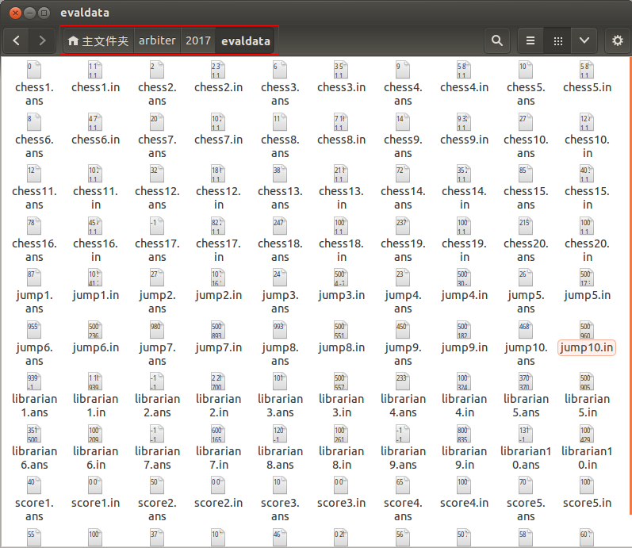
	~~~
	/home/noilinux/arbiter/
	└── 2017
	    ├── evaldata
	    │   ├── chess10.ans
	    │   ├── chess10.in
	    │   ├── chess11.ans
	    │   ├── chess11.in
	    │   ├── chess12.ans
	    │   ├── chess12.in
	    │   ├── chess13.ans
	    │   ├── chess13.in
	    │   ├── chess14.ans
	    │   ├── chess14.in
	    │   ├── chess15.ans
	    │   ├── chess15.in
	    │   ├── chess16.ans
	    │   ├── chess16.in
	    │   ├── chess17.ans
	    │   ├── chess17.in
	    │   ├── chess18.ans
	    │   ├── chess18.in
	    │   ├── chess19.ans
	    │   ├── chess19.in
	    │   ├── chess1.ans
	    │   ├── chess1.in
	    │   ├── chess20.ans
	    │   ├── chess20.in
	    │   ├── chess2.ans
	    │   ├── chess2.in
	    │   ├── chess3.ans
	    │   ├── chess3.in
	    │   ├── chess4.ans
	    │   ├── chess4.in
	    │   ├── chess5.ans
	    │   ├── chess5.in
	    │   ├── chess6.ans
	    │   ├── chess6.in
	    │   ├── chess7.ans
	    │   ├── chess7.in
	    │   ├── chess8.ans
	    │   ├── chess8.in
	    │   ├── chess9.ans
	    │   ├── chess9.in
	    │   ├── jump10.ans
	    │   ├── jump10.in
	    │   ├── jump1.ans
	    │   ├── jump1.in
	    │   ├── jump2.ans
	    │   ├── jump2.in
	    │   ├── jump3.ans
	    │   ├── jump3.in
	    │   ├── jump4.ans
	    │   ├── jump4.in
	    │   ├── jump5.ans
	    │   ├── jump5.in
	    │   ├── jump6.ans
	    │   ├── jump6.in
	    │   ├── jump7.ans
	    │   ├── jump7.in
	    │   ├── jump8.ans
	    │   ├── jump8.in
	    │   ├── jump9.ans
	    │   ├── jump9.in
	    │   ├── librarian10.ans
	    │   ├── librarian10.in
	    │   ├── librarian1.ans
	    │   ├── librarian1.in
	    │   ├── librarian2.ans
	    │   ├── librarian2.in
	    │   ├── librarian3.ans
	    │   ├── librarian3.in
	    │   ├── librarian4.ans
	    │   ├── librarian4.in
	    │   ├── librarian5.ans
	    │   ├── librarian5.in
	    │   ├── librarian6.ans
	    │   ├── librarian6.in
	    │   ├── librarian7.ans
	    │   ├── librarian7.in
	    │   ├── librarian8.ans
	    │   ├── librarian8.in
	    │   ├── librarian9.ans
	    │   ├── librarian9.in
	    │   ├── score10.ans
	    │   ├── score10.in
	    │   ├── score1.ans
	    │   ├── score1.in
	    │   ├── score2.ans
	    │   ├── score2.in
	    │   ├── score3.ans
	    │   ├── score3.in
	    │   ├── score4.ans
	    │   ├── score4.in
	    │   ├── score5.ans
	    │   ├── score5.in
	    │   ├── score6.ans
	    │   ├── score6.in
	    │   ├── score7.ans
	    │   ├── score7.in
	    │   ├── score8.ans
	    │   ├── score8.in
	    │   ├── score9.ans
	    │   └── score9.in
	    └── setup.cfg
	~~~
2. players存放考生试题         
	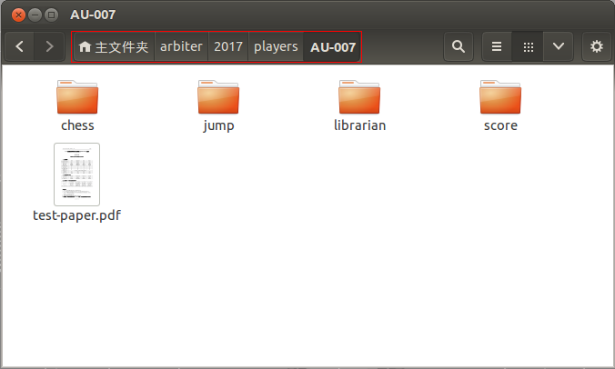
	~~~
	/home/noilinux/arbiter/
	└── 2017
	    ├── players
	    │   └── AU-007
	    │       ├── chess
	    │       │   ├── chess
	    │       │   ├── chess10.ans
	    │       │   ├── chess10.in
	    │       │   ├── chess11.ans
	    │       │   ├── chess11.in
	    │       │   ├── chess12.ans
	    │       │   ├── chess12.in
	    │       │   ├── chess13.ans
	    │       │   ├── chess13.in
	    │       │   ├── chess14.ans
	    │       │   ├── chess14.in
	    │       │   ├── chess15.ans
	    │       │   ├── chess15.in
	    │       │   ├── chess16.ans
	    │       │   ├── chess16.in
	    │       │   ├── chess17.ans
	    │       │   ├── chess17.in
	    │       │   ├── chess18.ans
	    │       │   ├── chess18.in
	    │       │   ├── chess19.ans
	    │       │   ├── chess19.in
	    │       │   ├── chess1.ans
	    │       │   ├── chess1.in
	    │       │   ├── chess20.ans
	    │       │   ├── chess20.in
	    │       │   ├── chess2.ans
	    │       │   ├── chess2.in
	    │       │   ├── chess3.ans
	    │       │   ├── chess3.in
	    │       │   ├── chess4.ans
	    │       │   ├── chess4.in
	    │       │   ├── chess5.ans
	    │       │   ├── chess5.in
	    │       │   ├── chess6.ans
	    │       │   ├── chess6.in
	    │       │   ├── chess7.ans
	    │       │   ├── chess7.in
	    │       │   ├── chess8.ans
	    │       │   ├── chess8.in
	    │       │   ├── chess9.ans
	    │       │   ├── chess9.in
	    │       │   ├── chess.bak
	    │       │   ├── chess.cpp
	    │       │   ├── chess.in
	    │       │   ├── chess.out
	    │       │   ├── chess.sh
	    │       │   └── chess.sh~
	    │       ├── jump
	    │       │   ├── jump
	    │       │   ├── jump10.ans
	    │       │   ├── jump10.in
	    │       │   ├── jump1.ans
	    │       │   ├── jump1.in
	    │       │   ├── jump2.ans
	    │       │   ├── jump2.in
	    │       │   ├── jump3.ans
	    │       │   ├── jump3.in
	    │       │   ├── jump4.ans
	    │       │   ├── jump4.in
	    │       │   ├── jump5.ans
	    │       │   ├── jump5.in
	    │       │   ├── jump6.ans
	    │       │   ├── jump6.in
	    │       │   ├── jump7.ans
	    │       │   ├── jump7.in
	    │       │   ├── jump8.ans
	    │       │   ├── jump8.in
	    │       │   ├── jump9.ans
	    │       │   ├── jump9.in
	    │       │   ├── jump.bak
	    │       │   ├── jump.cpp
	    │       │   ├── jump.dat
	    │       │   ├── jump.in
	    │       │   ├── jump.out
	    │       │   ├── jump.sh
	    │       │   └── jump.sh~
	    │       ├── librarian
	    │       │   ├── librarian
	    │       │   ├── librarian10.ans
	    │       │   ├── librarian10.in
	    │       │   ├── librarian1.ans
	    │       │   ├── librarian1.in
	    │       │   ├── librarian2.ans
	    │       │   ├── librarian2.in
	    │       │   ├── librarian3.ans
	    │       │   ├── librarian3.in
	    │       │   ├── librarian4.ans
	    │       │   ├── librarian4.in
	    │       │   ├── librarian5.ans
	    │       │   ├── librarian5.in
	    │       │   ├── librarian6.ans
	    │       │   ├── librarian6.in
	    │       │   ├── librarian7.ans
	    │       │   ├── librarian7.in
	    │       │   ├── librarian8.ans
	    │       │   ├── librarian8.in
	    │       │   ├── librarian9.ans
	    │       │   ├── librarian9.in
	    │       │   ├── librarian.cpp
	    │       │   ├── librarian.in
	    │       │   ├── librarian.out
	    │       │   ├── librarian.sh
	    │       │   └── librarian.sh~
	    │       ├── score
	    │       │   ├── score
	    │       │   ├── score10.ans
	    │       │   ├── score10.in
	    │       │   ├── score1.ans
	    │       │   ├── score1.in
	    │       │   ├── score2.ans
	    │       │   ├── score2.in
	    │       │   ├── score3.ans
	    │       │   ├── score3.in
	    │       │   ├── score4.ans
	    │       │   ├── score4.in
	    │       │   ├── score5.ans
	    │       │   ├── score5.in
	    │       │   ├── score6.ans
	    │       │   ├── score6.in
	    │       │   ├── score7.ans
	    │       │   ├── score7.in
	    │       │   ├── score8.ans
	    │       │   ├── score8.in
	    │       │   ├── score9.ans
	    │       │   ├── score9.in
	    │       │   ├── score.cpp
	    │       │   ├── score.in
	    │       │   ├── score.out
	    │       │   ├── score.sh
	    │       │   └── score.sh~
	    │       └── test-paper.pdf
	    └── setup.cfg
	~~~

## step5 评测考试

1. 重新打开Arbiter评测系统，选择**OPEN**按钮    
	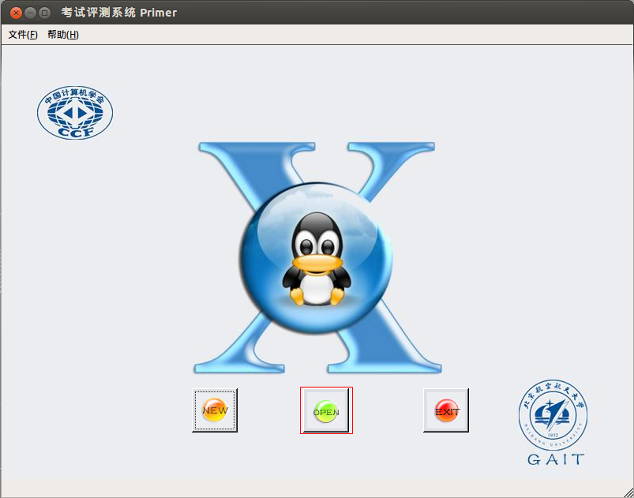
2. 选择setup.cfg配置文件     
	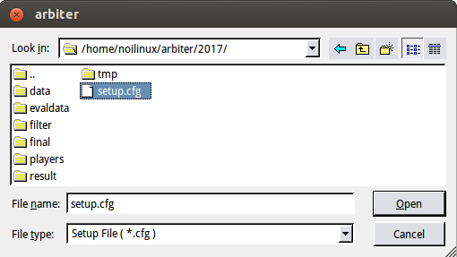
3. 选择**评测第1场**，双击选手，**查看选手程序**
	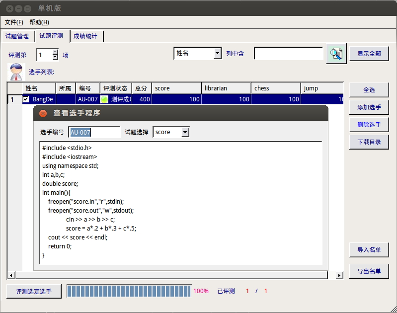
4. 选择评测考试    
	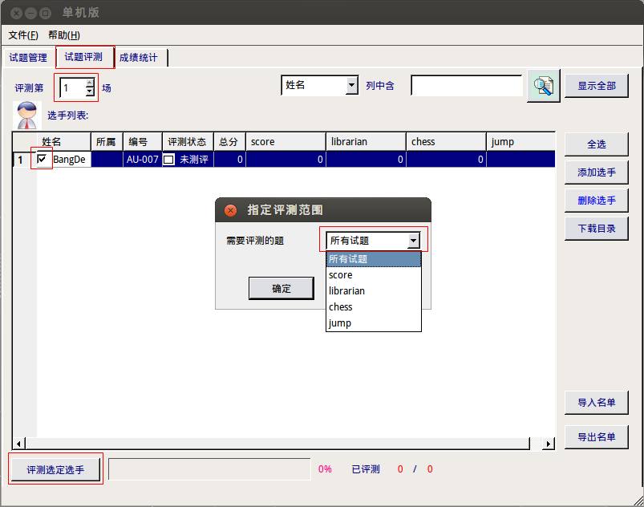
	- 选择**评测第1场**
	- **勾选**BangDe
	- 选择**评测选定选手**
	- 可以选择具体试题，也可默认所有试题
	- 点击**确定**
5. 出现评测完成，发现librarian得0分    
	

## step6 查看评测结果

1. 进入**主文件夹/arbiter/2017/result/day1/AU-007/**     
	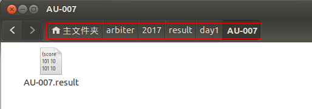
2. 鼠标右击**AU-007.result**文件并用**gedit**打开，发现**librarian编译失败**，进一步检查可知，不存在librarian.cpp源程序文件。    
	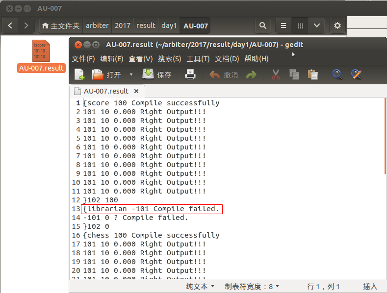
3. 提供librarian.cpp到**主文件夹/arbiter/2017/players/AU-007/librarian**下，重新评测，全部通过评测    
	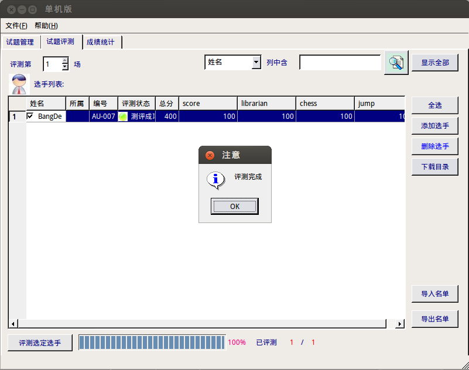

## step7 调试评测联动

打开GUIDE编程环境，并将工作目录指向选手目录，这样就可以边调试程序便进行评测了。

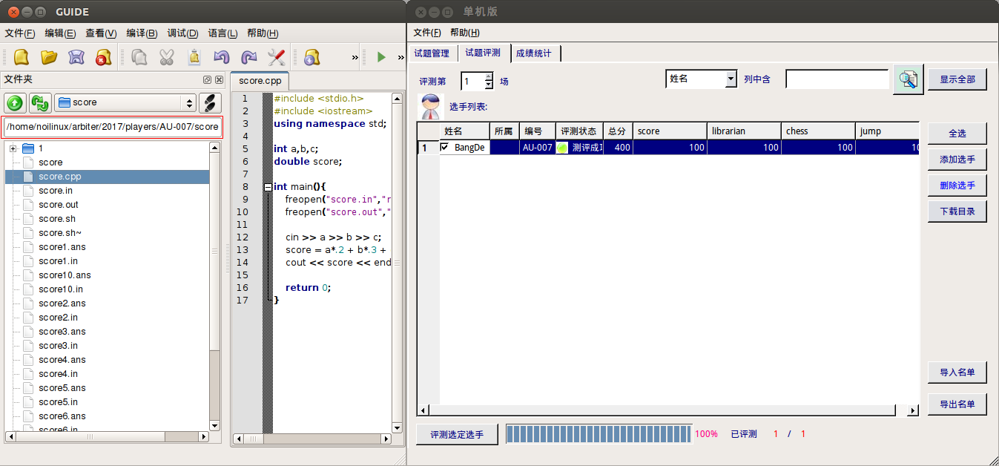

## w.微信订阅号

1. 智数精英-关注中小学程序设计及相关讨论
2. 随话录-记录小朋友们的成长时光
2. 西山征途-关注大学生成长、学习和生活

----------

## b.[返回首页](../../)
    
    
