# noilinux-1.4.1下GUIDE-1.0.0编程过程说明

本说明以 NOIP 2017年第23届普及组 复赛试题score为例，说明在noilinux下如何用GUIDE进行编程和测试的实践过程。

## 1. 准备复赛环节模拟试题

1. 通过 **位置** 菜单中的 **主文件夹** 菜单定位当前登录用户的主工作空间。   
	
2. 注意 **主文件夹** 下的 **Desktop** 文件夹，用来保存在桌面上呈现的内容，竞赛实战中试题可能保存在此处。在主窗口的空白处 **鼠标右键** 选择 **新建文件夹** ，新建 **arbiter** 文件夹和 **noip** 文件夹。   
	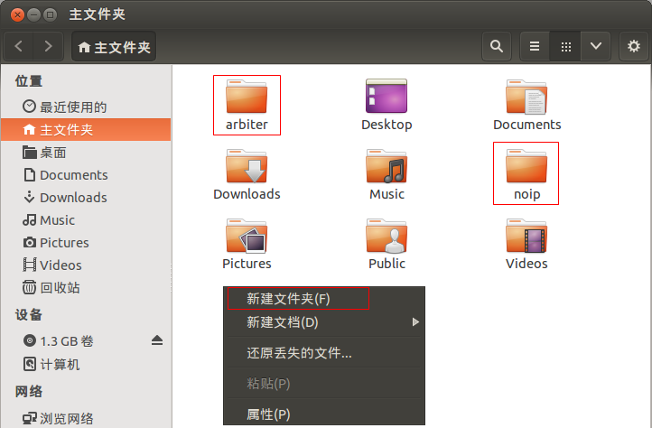
3. 打开 **Firefox** 浏览器，找到模拟试题的下载网站 **https://daweizh.github.io/noip/** ，选择 **普及组** 中的 **复赛试题** 。竞赛实战中你的考题一般会呈现在桌面(~/Desktop)文件夹下。     
	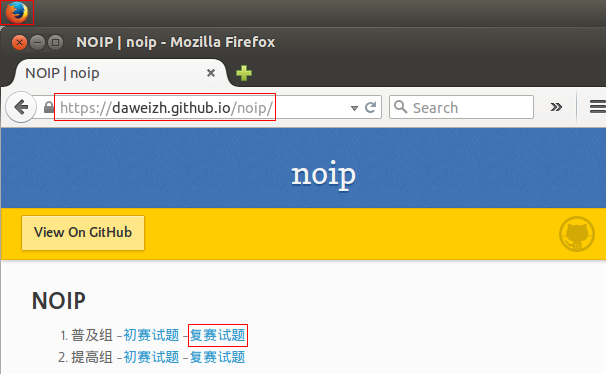
4. 以2017年第23届普及组复赛试题为例，鼠标右键 **模拟** 选择 **Save Link As...** 。    
	
5. 在弹出的保存文件对话框中选择 **主文件夹** 下的 **noip** 文件夹，文件名保持默认不变，点击 **保存** 按钮。   
	
6. 可以点击 **Firefox** 上的 **下载状态按钮** 观察下载进度，等待下载完成。   
	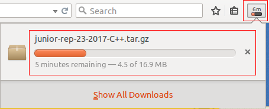
7. 下载完成后，回到 **主文件夹** 位置，进入 **noip** 文件夹，鼠标右键模拟试题 **junior-rep-23-2017-C++.tar.gz** 压缩包，选择 **提取到此处** 菜单（在竞赛实战中此时会提示输入考试密码，注意大小写的区分，数字和英文的区分，不要因紧张着急输错），出现同名的文件夹时，试题准备完成。   
	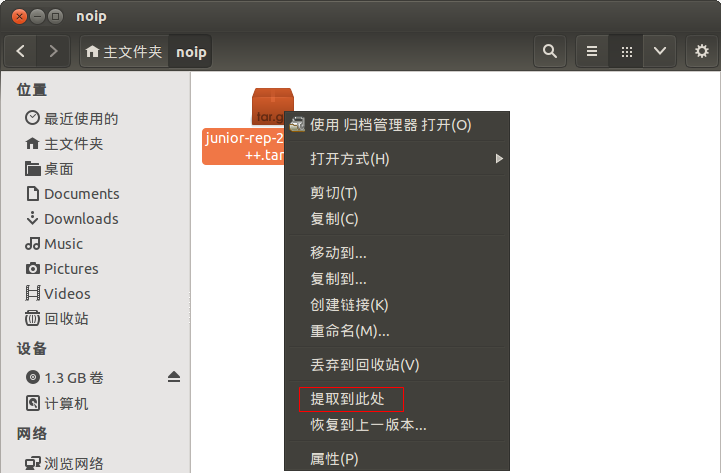

## 2. 用CUIDE写C++程序
1. 选择桌面左上角 **应用程序** 菜单选择 **编程** 子菜单，打开 **GUIDE** 编程环境。   
	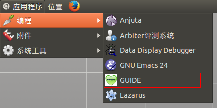
2. 修改 **快速定位** 内容到当前工作文件夹 **~/noip/junior-rep-23-2017-C++/score**， 左侧项目浏览器中出现测试数据。   
	
3. 选择 **编辑** 菜单中的 **选项** 菜单，进行开发环境设置。    
	
4. 选择 **自动补全** ，去选 **启用自动完成** ， 用来避免自动补全卡死（先编码试一下，如果自动补全好用，可以跳过此步），点击 **OK** 按钮完成设置。 如果你喜欢还可以在此处进行其他设置。   
	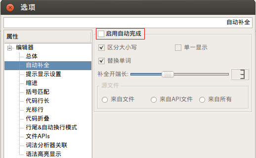
5. 在GUIDE工具栏选择选择 **新建** 图标，出现标题为 **未命名**\*（注意\*表示没有保存） 的编辑窗口，输入几行C++程序代码。
	~~~cpp
    #include <stdio.h>
    #include <iostream>
	~~~
	选择 **保存** 图标，出现 **保存** 对话框，在 **File Name** 处输入 **score.cpp** ，点击 **Save** 按钮保存该文件，观察编辑窗口标题的变化。
	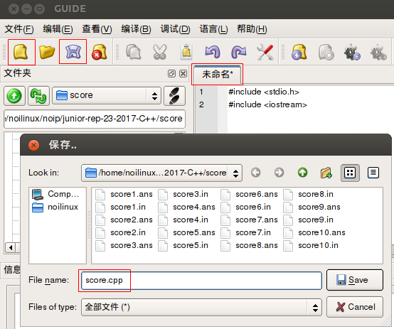
	完成全部代码
	~~~
    #include <stdio.h>
    #include <iostream>
    using namespace std;
    
    int main(){
        int a,b,c;
        
        cin >> a >> b >> c;
        cout <<  a * 0.2 + b*0.3 + c*0.5 << endl;
        
        return 0;
    }
	~~~
	按 **Ctrl+s** 组合键或工具条上 **保存** 图标存盘，注意观察编辑窗口标题的变化。
6. 选择 **编译** 菜单，注意 **编译 F7** 和 **运行 Ctrl+F5** 两个子菜单，按 **F7** 键，观察 **信息查看** 栏的输出信息。
	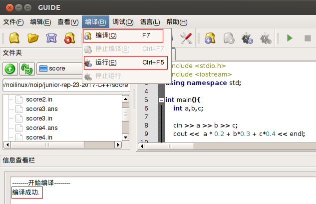
7. 按 **Ctrl+F5** 组合键执行程序，输入测试数据并观察执行结果。按任意键关闭窗口。
	

## 3. 对拍测试

1. 在GUIDE中完善刚刚执行通过的程序，增加输入/输出重定向语句。
	~~~
	#include <stdio.h>
	#include <iostream>
	using namespace std;
	
	int main(){
		int a,b,c;
		
		freopen("score.in","r",stdin);
		freopen("score.out","w",stdout);
		
		cin >> a >> b >> c;
		cout <<  a * 0.2 + b*0.3 + c*0.4 << endl;
		
		return 0;
	}
	~~~
2. 按 **F7** 键重新编译。
3. 回到 **主文件夹 noip junior-rep-23-2017-C++ score** 文件夹，在主窗口空白处鼠标右键，**新建文档** ，选择 **空白文档** 。
	
4. 在新建文档处输入文件名 **score.sh** 。    
	
5. 鼠标右击刚刚建立的文件 **score.sh** ，在弹出菜单中选择 **打开方式**，进一步选择 **gedit** 。    
	
6. 在gedit编辑器中输入如下shell脚本程序：
	~~~
    #!/bin/bash
    i=1
    while [ $i -le 10 ]
    do
        echo score$i
        cp -f score$i.in score.in
        ./score
        #./score < score$i.in > score.out
        if diff score$i.ans score.out ; then
            echo Ac
        fi
        i=$(($i+1))
    done
	~~~
	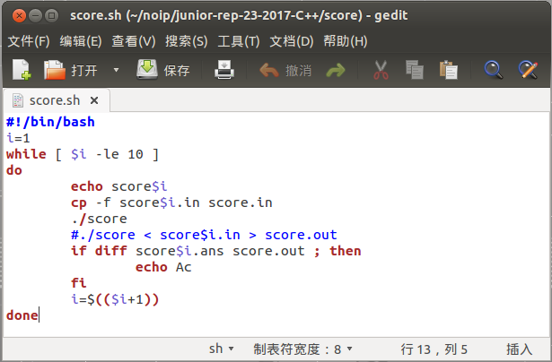   
	根据测试数据的个数修改上面数字 **10**，编辑完成之后存盘退出。
7. 选择 **应用程序**，选择 **附件**，选择 **终端** ，打开命令行终端。   
	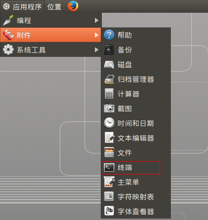
8.  在命令行终端里，用 **cd** 命令修改当前工作目录 **~** 代表 **主文件夹** ，**ls** 命令列表当前目录内容。
	~~~
	noilinux@ubuntu:~$ cd noip/junior-rep-23-2017-C++/score/
	noilinux@ubuntu:~/noip/junior-rep-23-2017-C++/score$ ls
	~~~
	
9. 在 **score** 文件夹下执行 **sudo sh ./score.sh** 命令，输入超级管理员密码 **123456** ，执行对拍脚本后，显示正确的对拍结果如下：    
	~~~
	noilinux@ubuntu:~/noip/junior-rep-23-2017-C++/score$ sudo sh ./score.sh
	[sudo] password for noilinux: 
	score1
	Ac
	score2
	Ac
	~~~
	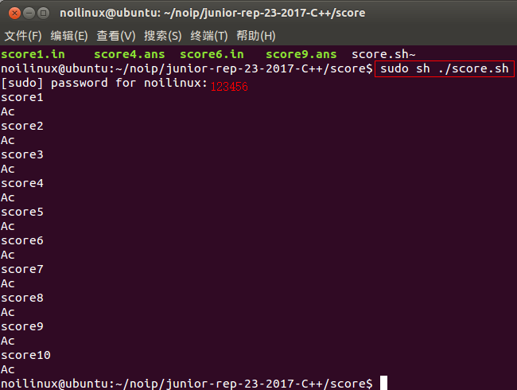   
	Ac表示执行结果正确
10. 错误的对拍结果如下：    
	~~~
	noilinux@ubuntu:~/noip/junior-rep-23-2017-C++/score$ sudo sh ./score.sh
	score1
	1c1
	&lt; 40
	---
	&gt; 32
 	~~~
	

## w.微信订阅号

1. 智数精英-关注中小学程序设计及相关讨论
2. 随话录-记录小朋友们的成长时光
2. 西山征途-关注大学生成长、学习和生活

----------

## b.[返回首页](../../)
	
	
