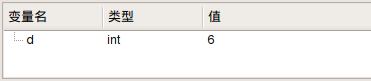
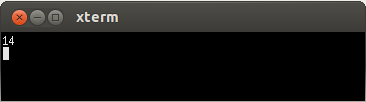

# 21.1 coin

- 张大为
- 辽宁师范大学计算机与信息技术学院@大连
- [https://daweizh.github.io/noip/](https://daweizh.github.io/noip/)  QQ:1243605845

## step1

用测试数据coin1.ans的数据作为输出，编写主程序框架。

~~~cpp
#include <iostream>
#include <cstdio>
using namespace std;

int main(){

    cout << 14 << endl;
    
    return 0;
}
~~~

## step2

复制coin1.in作为输入测试数据coin.in。

~~~cpp
6
~~~

## step3

设计输入数据变量及其对应的数据类型。
设计数据读取及其运算结构。

~~~cpp
#include <iostream>
#include <cstdio>
using namespace std;

int d;

int main(){
    freopen("coin.in","r",stdin);
    
    cin >> d;
    
    cout << 14 << endl;
    
    return 0;
}

~~~

观察数据读取情况。

## step4

增加中间变量，组织算法逻辑，按`Ctrl+F5`观察计算结果。

~~~cpp
#include <iostream>
#include <cstdio>
using namespace std;

int d;
int i,m;

int main(){
    freopen("coin.in","r",stdin);
    
    cin >> d;
    for(i=1;i<d;i++){
        m = m + i*i;
        d = d - i;
    }
    m = m + i * d;
    
    cout << m << endl;
    
    return 0;
}
~~~

## step5

增加输出重定向，完成程序，按`F7`编译通过。
按`Ctrl+F5`执行，将计算机结果coin.out与coin1.ans比较，看是否正确。

~~~cpp
#include <iostream>
#include <cstdio>
using namespace std;

int d;
int i,m;

int main(){
    freopen("coin.in","r",stdin);
    freopen("coin.out","w",stdout);
    
    cin >> d;
    for(i=1;i<d;i++){
        m = m + i*i;
        d = d - i;
    }
    m = m + i * d;
    
    cout << m << endl;
    
    return 0;
}
~~~

coin.out

~~~cpp
14
~~~

## step6

编写对拍程序，检测通过测试点情况。

~~~sh
#!/bin/bash
i=1
while [ $i -le 10 ]
do
    echo coin$i
    cp -f coin$i.in coin.in
    ./coin
    if diff coin$i.ans coin.out ; then
        echo Ac
    fi
    i=$(($i+1))
done
~~~

## step7

执行对拍程序，查看结果，Ac为通过的测试用例。

~~~sh
$ cd ~/noip/2015/coin/
$ sh ./coin.sh
~~~

执行结果如下：

~~~sh
coin1
Ac
coin2
Ac
coin3
Ac
coin4
Ac
coin5
Ac
coin6
Ac
coin7
Ac
coin8
Ac
coin9
Ac
coin10
Ac
~~~

## w. 微信订阅号

1. 智数精英-关注中小学程序设计及相关讨论
2. 随话录-记录小朋友们的成长时光
2. 西山征途-关注大学生成长、学习和生活

----------

## b. [返回](../../)
    
## h. [首页](../../../../)
