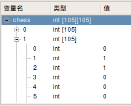

# 23.3 chess

- 张大为 QQ:1243605845 @大连
- 辽宁师范大学计算机与信息技术学院
- [https://daweizh.github.io/noip/](https://daweizh.github.io/noip/) 

## step1

以chess1.ans作为输出内容，建立最小可提交程序框架。

~~~
#include <stdio.h>
#include <iostream>
using namespace std;

int main(){
    freopen("chess.in","r",stdin);
    freopen("chess.out","w",stdout);

    cout << 0 << endl;

    fclose(stdout);
    fclose(stdin);

    return 0;
}
~~~

## step2

编写对拍程序，通过测试点1。

~~~sh
#!/bin/bash
i=1
while [ $i -le 20 ]
do
    echo chess$i
    cp -f chess$i.in chess.in
    ./chess
    if diff chess$i.ans chess.out ; then
        echo Ac
    fi
    i=$(($i+1))
done
~~~

执行对拍程序，观测测试结果。

~~~sh
$ cd ~/noip/2017/chess/
$ sh ./chess.sh 
chess1
Ac
~~~

只有chess1测试数据通过，可得5分。

## step2

编制测试样例数据 chess.in。

~~~cpp
5 7
1 1 0
1 2 0
2 2 1
3 3 1
3 4 0
4 4 1
5 5 0
~~~

## step3

读取输入数据。

~~~cpp
#include <stdio.h>
#include <iostream>
using namespace std;

int m,n,chess[105][105];

int main(){
    freopen("chess.in","r",stdin);
    
    int x, y, c;
    cin >> m >> n;
    
    for(int i=1;i<=n;i++){
        cin >> x >> y >> c;
        chess[x][y]=c+1;
    }

    return 0;
}
~~~

查看变量观察读入数据是否正确

## step4

深度优先（DFS）走四方。

~~~cpp
#include <stdio.h>
#include <iostream>
#include <cstring>
using namespace std;

int m,n,chess[105][105];
int step[4][2]={ {0,-1},{0,1},{-1,0},{1,0} };

void walk(int sx,int sy,int coin,int magic){
    for(int i=0;i<4;i++){
        int tx = sx + step[i][0];
        int ty = sy + step[i][1];
        if(tx<=m && ty<=m && tx >=1 && ty >=1){
            walk(tx,ty,coin,0);
        }
    }

    return;
}

int main(){
    freopen("chess.in","r",stdin);
    
    int x, y, c;
    cin >> m >> n;
    
    for(int i=1;i<=n;i++){
        cin >> x >> y >> c;
        chess[x][y]=c+1;
    }

    walk(1,1,0,0);
    
    return 0;
}
~~~

## step5

增加算法逻辑——金币计算方法和递归结束方法。

~~~cpp
#include <stdio.h>
#include <iostream>
#include <cstring>
using namespace std;

int m,n,chess[105][105];
int step[4][2]={ {0,-1},{0,1},{-1,0},{1,0} };
int cost[105][105];

void walk(int sx,int sy,int coin,int magic){
    if (coin < cost[sx][sy])
        cost[sx][sy] = coin;
    else
        return ;
        
    for(int i=0;i<4;i++){
        int tx = sx + step[i][0];
        int ty = sy + step[i][1];
        if(tx<=m && ty<=m && tx >=1 && ty >=1){
            if(chess[tx][ty]>0){
                if(chess[sx][sy]==chess[tx][ty]){
                    walk(tx,ty,coin,0);
                }else{
                    walk(tx,ty,coin+1,0);
                }
            }else if(magic==0){
                chess[tx][ty] = chess[sx][sy];
                walk(tx,ty,coin+2,1);
                chess[tx][ty] = 0;
            }
        }
    }

    return;
}

int main(){
    freopen("chess.in","r",stdin);
    
    memset(cost,0x7f,sizeof(cost));
    
    int x, y, c;
    cin >> m >> n;
    
    for(int i=1;i<=n;i++){
        cin >> x >> y >> c;
        chess[x][y]=c+1;
    }

    walk(1,1,0,0);
    
    if(cost[m][m]==cost[0][0])
        cout << -1 << endl;
    else
        cout << cost[m][m] << endl;
    
    return 0;
}
~~~

## step6

增加数据输出方法，准备测试提交。

~~~cpp
#include <stdio.h>
#include <iostream>
#include <cstring>
using namespace std;

int m,n,chess[105][105];
int step[4][2]={ {0,-1},{0,1},{-1,0},{1,0} };
int cost[105][105];

void walk(int sx,int sy,int coin,int magic){
    if (coin < cost[sx][sy])
        cost[sx][sy] = coin;
    else
        return ;
        
    for(int i=0;i<4;i++){
        int tx = sx + step[i][0];
        int ty = sy + step[i][1];
        if(tx<=m && ty<=m && tx >=1 && ty >=1){
            if(chess[tx][ty]>0){
                if(chess[sx][sy]==chess[tx][ty]){
                    walk(tx,ty,coin,0);
                }else{
                    walk(tx,ty,coin+1,0);
                }
            }else if(magic==0){
                chess[tx][ty] = chess[sx][sy];
                walk(tx,ty,coin+2,1);
                chess[tx][ty] = 0;
            }
        }
    }

    return;
}

int main(){
    freopen("chess.in","r",stdin);
    freopen("chess.out","w",stdout);
    
    memset(cost,0x7f,sizeof(cost));
    
    int x, y, c;
    cin >> m >> n;
    
    for(int i=1;i<=n;i++){
        cin >> x >> y >> c;
        chess[x][y]=c+1;
    }

    walk(1,1,0,0);
    
    if(cost[m][m]==cost[0][0])
        cout << -1 << endl;
    else
        cout << cost[m][m] << endl;
    
    return 0;
}
~~~

## step7

编写对拍测试程序。

~~~sh
#!/bin/bash
i=1
while [ $i -le 20 ]
do
    echo chess$i
    cp -f chess$i.in chess.in
    ./chess
    if diff chess$i.ans chess.out ; then
        echo Ac
    fi
    i=$(($i+1))
done
~~~

## step8

执行对拍程序，查看结果,Ac为通过的测试用例。

~~~sh
$ cd ~/noip/junior-rep-23-2017-C++/chess/
$ sh ./chess.sh
~~~
执行结果如下：
~~~sh
chess1
Ac
chess2
Ac
chess3
Ac
chess4
Ac
chess5
Ac
chess6
Ac
chess7
Ac
chess8
Ac
chess9
Ac
chess10
Ac
chess11
Ac
chess12
Ac
chess13
Ac
chess14
Ac
chess15
Ac
chess16
Ac
chess17
Ac
chess18
Ac
chess19
Ac
chess20
Ac
~~~

## w. 微信订阅号

1. 智数精英-关注中小学程序设计及相关讨论
2. 随话录-记录小朋友们的成长时光
2. 西山征途-关注大学生成长、学习和生活

----------

## b. [返回](../../)
    
## h. [首页](../../../../)
