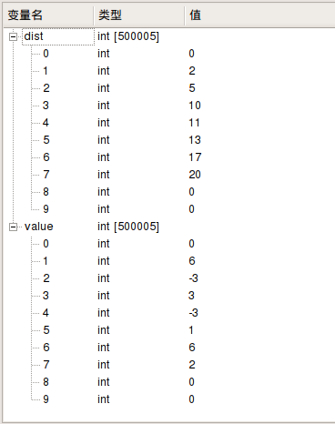

# 23.4 jump

- 张大为
- 辽宁师范大学计算机与信息技术学院@大连
- [https://daweizh.github.io/noip/](https://daweizh.github.io/noip/)  QQ:1243605845

## step1

建立程序框架，准备可以提交的最小版本。

~~~cpp
#include<cstdio>
#include<iostream>
using namespace std;

int main(){

    cout << -1 << endl;;

    return 0;
}
~~~

## step2 

编制测试样例数据 chess.in。

~~~cpp
7 4 10
2 6
5 -3
10 3
11 -3
13 1
17 6
20 2
~~~

## step3 

读取输入数据

~~~cpp
#include <cstdio>
#include <iostream>
using namespace std;

int n,d,k,dist[500005],value[500005];

int main(){
    freopen("jump.in","r",stdin);
    
    long long sum = 0;
    cin >> n >> d >> k;
    for (int i=1;i<=n;i++){
        cin >> dist[i] >> value[i];
        if(value[i]>0) sum = sum + value[i];
    }
    
    if(sum < k){
        cout << -1 << endl;
        return 0;
    }
    
    return 0;
}
~~~

查看变量，观察读入数据是否正确。

## step4 

建立二分查找程序框架。

~~~cpp
#include <cstdio>
#include <iostream>
using namespace std;

int n,d,k,dist[500005],value[500005];

bool check(int g){

    return 0;
}

int main(){
    freopen("jump.in","r",stdin);
    
    long long sum = 0;
    cin >> n >> d >> k;
    for (int i=1;i<=n;i++){
        cin >> dist[i] >> value[i];
        if(value[i]>0) sum = sum + value[i];
    }
    
    if(sum < k){
        cout << -1 << endl;
        return 0;
    }
    
    int lg=0,rg=1000000000;
    while(lg<rg){
        int midg = (lg+rg)>>1;
        if(check(midg)) 
            rg = midg;
        else
            lg = midg + 1;
    }
    
    cout << rg << endl;
    
    return 0;
}
~~~

每次执行的midg结果。 

~~~cpp
500000000
750000000
875000000
937500000
968750000
984375000
992187500
996093750
998046875
999023438
999511719
999755860
999877930
999938965
999969483
999984742
999992371
999996186
999998093
999999047
999999524
999999762
999999881
999999941
999999971
999999986
999999993
999999997
999999999
~~~

最终的输出结果。

~~~cpp
1000000000
~~~

## step5

暴力搜索到当前位置的最少金币数，进而找到全局最优解。

~~~cpp
#include <cstdio>
#include <iostream>
#include <cstring>
using namespace std;

int n,d,k,dist[500005],value[500005];
long long coins[500005];
int lpos,rpos;

bool check(int g){
    lpos = d-g; //跳的最短距离 
    rpos = d+g; //跳的最长距离 
    if(lpos<=0) lpos = 1;
    memset(coins,-127,sizeof(coins));  //设为很小的负数
    coins[0]=0;
    for(int i=1; i<=n; i++){
        for(int j=i-1; j>=0; j--){
            if(dist[i]-dist[j]<lpos) continue;
            if(dist[i]-dist[j]>rpos) break;
            coins[i]=max(coins[i],coins[j]+value[i]);
            if(coins[i]>=k) return 1;
        }
    }
    return 0;
}

int main(){
    freopen("jump.in","r",stdin);
    freopen("jump.out","w",stdout);
    
    long long sum = 0;
    cin >> n >> d >> k;
    for (int i=1;i<=n;i++){
        cin >> dist[i] >> value[i];
        if(value[i]>0) sum = sum + value[i];
    }
    
    if(sum < k){
        cout << -1 << endl;
        return 0;
    }
    
    int lg=0,rg=1000000000;
    while(lg<rg){
        int midg = (lg+rg)>>1;
        if(check(midg)) {
            rg = midg;
        }else{
            lg = midg + 1;
        }
    }
    
    cout << rg << endl;
    
    return 0;
}
~~~

## step6

增加输出重定向功能，并编译通过。

~~~cpp
freopen("jump.out","w",stdout);
~~~

## step7

准备对拍程序。

~~~sh
#!/bin/bash
i=1
while [ $i -le 10 ]
do
    echo jump$i
    cp -f jump$i.in jump.in
    ./jump
    if diff jump$i.ans jump.out ; then
        echo Ac
    fi
    i=$(($i+1))
done
~~~

## step8

执行对拍程序，查看结果，Ac为通过的测试用例。

~~~sh
$ cd ~/noip/junior-rep-23-2017-C++/jump/
$ sh ./jump.sh
~~~

执行结果如下：

~~~sh
jump1
Ac
jump2
Ac
jump3
Ac
jump4
Ac
jump5
Ac
jump6
Ac
jump7
Ac
jump8
Ac
jump9
Ac
jump10
Ac
~~~

## step9

动态规划到达当前位置花费最少金币数，进而得到全局最优解。

~~~cpp
#include <cstdio>
#include <iostream>
#include <cstring>
using namespace std;

int n,d,k,dist[500005],value[500005];
long long coins[500005],inf;
int head,tail,deque[500005];  

bool check(int g){
    coins[0] = 0;
    deque[0] = 0;
    head = tail = 0;
    int pointer = 1;
    
    for(int i=1;i<=n;i++){
        while(pointer<=n && dist[pointer]<=min(dist[i]-1,dist[i]-d+g)){
            while(head<=tail && coins[deque[tail]] <=coins[pointer])  tail--;
            deque[++tail] = pointer++;
        }

        while(head<=tail && dist[deque[head]]<dist[i]-d-g)  head++;
            
        if(head<=tail && deque[head] <=dist[i]-d+g) 
            coins[i] = coins[deque[head]] + value[i];
        else
            coins[i] = -inf;
        
        if (coins[i]>k) return 1;
    }
    return 0;
}

int main(){
    freopen("jump.in","r",stdin);
    freopen("jump.out","w",stdout);
    
    inf = 1000000000;
    inf = inf * inf;
    
    long long sum = 0;
    cin >> n >> d >> k;
    for (int i=1;i<=n;i++){
        cin >> dist[i] >> value[i];
        if(value[i]>0) sum = sum + value[i];
    }
    
    if(sum < k){
        cout << -1 << endl;
        return 0;
    }
    
    int lg=0,rg=1000000000;
    while(lg<rg){
        int midg = (lg+rg)>>1;
        if(check(midg)) {
            rg = midg;
        }else{
            lg = midg + 1;
        }
    }
    
    cout << rg << endl;
    
    return 0;
}
~~~

## w. 微信订阅号

1. 智数精英-关注中小学程序设计及相关讨论
2. 随话录-记录小朋友们的成长时光
2. 西山征途-关注大学生成长、学习和生活

----------

## b. [返回](../../)
    
## h. [首页](../../../../)
