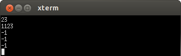

# 23.2 librarian

- 张大为
- 辽宁师范大学计算机与信息技术学院@大连
- [https://daweizh.github.io/noip/](https://daweizh.github.io/noip/)  QQ:1243605845

## step1
建立程序框架，熟悉编译执行过程，并把样例输出作为测试信息输出。
~~~
#include <stdio.h>
#include <iostream>
using namespace std;

int main(){
    cout << "-1" << endl;
    return 0;
}
~~~
注意：存盘用**Ctrl+s**，编译用**F7**，执行用**Ctrl+F5**。

## step2
综合分析试题描述对数据建模，找到基本的输入输出数据存储方式，并确定它们的数据类型。
~~~
int n;              //图书馆里书的数量
int q;              //读者的数量
int book[1005];     //n本书的图书编号
int reqlen[1005];   //q个需求码的长度，与需求码的下标对应
int reqcode[1005];  //q个读者的需求码
~~~
对于 100%的数据， 1 ≤ n，q ≤ 1,000，
所有的图书编码和需求码均不超过 10,000,000。
所以上述变量定义为**int**符合要求。

## step3
由于需要读入n本图书和q个读者的数据，所以采用**循环读入数组**的数据读取策略。
~~~
cin >> n >> q;
for(int i=0;i<n;i++)
    cin >> book[i];
for(int i=0;i<q;i++){
    cin >> reqlen[i] >> reqcode[i] ;
}
~~~

## step4
根据题意，求**每位读者（q位）**需要的书，并判断该书是否存在。
~~~
for(int i=0;i<q;i++){
    int min = 100000000;    //设定一个最大的，不存在的图书编码
    
    //查找图书的方法，并把找到的图书编码存入min
    
}
~~~
根据每位读者需求码查找图书的过程，就是把图书编码的后几位按照需求码的长度截取下来进行比对的过程。
要想截取图书编码的后几位，需要根据需求码的长度计算**模数**的大小。变量m用来保存模数。
~~~
int m = 1;
for(int j=0;j<reqlen[i];j++){
    m = m * 10;
}
~~~
接下来对当前读者**i**就可以用他的需求码比对截取后的图书码了，
如果发现新找到的图书码比前面找到的图书码小，用新的图书码替换旧的图书码。
~~~
for(int j=0;j<n;j++){
    if(book[j]%m==reqcode[i]){
        if(book[j]<min)
            min = book[j];
    }
}
~~~

## step5
根据【输出格式】和【输入输出样例】确定输出策略——对每位读者判断是否找到了他所需要的那本书。
~~~
if(min<100000000)       //min被改变了，说明所要的图书编码找到了
    cout << min << endl;
else                    //min没有变化，说明没有找到任何图书
    cout << -1 << endl;
~~~

## step6
创建【输入输出样例1】中的输入文件score.in。
~~~
5 5
2123
1123
23
24
24
2 23
3 123
3 124
2 12
2 12
~~~
在程序中增加输入重定向语句
~~~
freopen("score.in","r",stdin);
~~~

## step7
完整的程序代码为如下，按**F7**键编译，按**Ctrl+F5**键执行，观察执行结果的正确性。
~~~
#include <stdio.h>
#include <iostream>
using namespace std;

int n;              //图书馆里书的数量
int q;              //读者的数量
int book[1005];     //n本书的图书编号
int reqlen[1005];   //q个需求码的长度，与需求码的下标对应
int reqcode[1005];  //q个读者的需求码

int main(){
	freopen("librarian.in","r",stdin);
	
	cin >> n >> q;
	for(int i=0;i<n;i++)
		cin >> book[i];
	for(int i=0;i<q;i++){
		cin >> reqlen[i] >> reqcode[i] ;
	}
	
	for(int i=0;i<q;i++){
		int min = 100000000;

		int m = 1;
		for(int j=0;j<reqlen[i];j++){
			m = m * 10;
		}
		
		for(int j=0;j<n;j++){
			if(book[j]%m==reqcode[i]){
				if(book[j]<min)
					min = book[j];
			}
		}

		if(min<100000000)       //min被改变了，说明所要的图书编码找到了
		    cout << min << endl;
		else                    //min没有变化，说明没有找到任何图书
		    cout << -1 << endl;
	}
	
	return 0;
}
~~~

## step8
编写测试对拍脚本。
~~~
#!/bin/bash
i=1
while [ $i -le 10 ]
do
    echo librarian$i
    cp -f librarian$i.in librarian.in
    ./librarian
    if diff librarian$i.ans librarian.out ; then
        echo Ac
    fi
    i=$(($i+1))
done
~~~

## step9
增加输出重定向语句，准备提交代码的最终版本，不要忘了按**F7**重新编译。
~~~
#include <stdio.h>
#include <iostream>
using namespace std;

int n;              //图书馆里书的数量
int q;              //读者的数量
int book[1005];     //n本书的图书编号
int reqlen[1005];   //q个需求码的长度，与需求码的下标对应
int reqcode[1005];  //q个读者的需求码

int main(){
	freopen("librarian.in","r",stdin);
	freopen("librarian.out","w",stdout);
	
	cin >> n >> q;
	for(int i=0;i<n;i++)
		cin >> book[i];
	for(int i=0;i<q;i++){
		cin >> reqlen[i] >> reqcode[i] ;
	}
	
	for(int i=0;i<q;i++){
		int min = 100000000;

		int m = 1;
		for(int j=0;j<reqlen[i];j++){
			m = m * 10;
		}
		
		for(int j=0;j<n;j++){
			if(book[j]%m==reqcode[i]){
				if(book[j]<min)
					min = book[j];
			}
		}

		if(min<100000000)       //min被改变了，说明所要的图书编码找到了
		    cout << min << endl;
		else                    //min没有变化，说明没有找到任何图书
		    cout << -1 << endl;
	}
	
	return 0;
}
~~~

## step10
执行对拍程序，查看结果,Ac为通过的测试用例。
~~~
$ cd ~/noip/junior-rep-23-2017-C++/librarian/
$ sh ./librarian.sh
~~~
执行结果如下：
~~~
librarian1
Ac
librarian2
Ac
librarian3
Ac
librarian4
Ac
librarian5
Ac
librarian6
Ac
librarian7
Ac
librarian8
Ac
librarian9
Ac
librarian10
Ac
~~~

## w. 微信订阅号

1. 智数精英-关注中小学程序设计及相关讨论
2. 随话录-记录小朋友们的成长时光
2. 西山征途-关注大学生成长、学习和生活

----------

## b. [返回](../../)
    
## h. [首页](../../../../)
