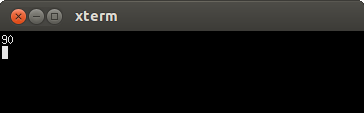

# 23.1 score

- 张大为
- 辽宁师范大学计算机与信息技术学院@大连
- [https://daweizh.github.io/noip/](https://daweizh.github.io/noip/)  QQ:1243605845

## step1
建立程序框架，熟悉编译执行过程，并把样例输出作为测试信息输出。
~~~cpp
#include <stdio.h>
#include <iostream>
using namespace std;

int main(){
    cout << "90" << endl;
    return 0;
}
~~~
注意：存盘用**Ctrl+s**，编译用**F7**，执行用**Ctrl+F5**。

## step2
综合分析试题描述对数据建模，找到基本的输入输出数据存储方式，并确定它们的数据类型。
~~~cpp
int a;      //作业成绩
int b;      //小测成绩
int c;      //期末考试成绩
int score;  //总成绩
~~~

## step3
由于需要计算成绩的只有牛牛，确定数据的读入策略为**一次性读入**。
~~~cpp
cin >> a >> b >> c;
~~~

## step4
根据试题中给出的计算总成绩的方法，确定数据加工方法（算法）。
由于所有变量都定义为int型，所以直接用整型参与计算避免精度损失。
~~~cpp
score = (a*2 + b*3 + c*5)/10;
~~~
注意：20%=2/10=0.2；30%=3/10=0.3；50%=5/10=0.5。

## step5
根据【输出格式】和【输入输出样例】确定输出策略。
~~~cpp
cout << score << endl;
~~~

## step6
创建【输入输出样例1】中的输入文件score.in。
~~~cpp
100 100 80
~~~
在程序中增加输入重定向语句
~~~cpp
freopen("score.in","r",stdin);
~~~

## step7
完整的程序代码为如下，按**F7**键编译，按**Ctrl+F5**键执行，观察执行结果的正确性。
~~~cpp
#include <stdio.h>
#include <iostream>
using namespace std;

int a;      //作业成绩
int b;      //小测成绩
int c;      //期末考试成绩
int score;  //总成绩

int main(){
    freopen("score.in","r",stdin);
    
    cin >> a >> b >> c;
    //直接用整数计算，避免小数参与计算带来的精度问题
    score = (a*2 + b*3 + c*5)/10;
    //直接用cout << a*.2+b*.3+c*.5 << endl;也可以
    //立即数输出不用根据变量类型进行转换
    cout << score << endl;
    
    return 0;
}
~~~

## step8
编写测试对拍脚本。
~~~
#!/bin/bash
i=1
while [ $i -le 10 ]
do
    echo score$i
    cp -f score$i.in score.in
    ./score
    if diff score$i.ans score.out ; then
        echo Ac
    fi
    i=$(($i+1))
done
~~~

## step9
增加输出重定向语句，准备提交代码的最终版本，不要忘了按**F7**重新编译。
~~~cpp
#include <stdio.h>
#include <iostream>
using namespace std;

int a;      //作业成绩
int b;      //小测成绩
int c;      //期末考试成绩
int score;  //总成绩
    
int main(){
    freopen("score.in","r",stdin);
    freopen("score.out","w",stdout);
    
    cin >> a >> b >> c;
    //直接用整数计算，避免小数参与计算带来的精度问题
    score = (a*2 + b*3 + c*5)/10;
    //直接用cout << a*.2+b*.3+c*.5 << endl;也可以
    //立即数输出不用根据变量类型进行转换
    cout << score << endl;
    
    return 0;
}
~~~

## step10
执行对拍程序，查看结果,Ac为通过的测试用例。
~~~
$ cd ~/noip/junior-rep-23-2017-C++/score/
$ sh ./score.sh
~~~
执行结果如下：
~~~
score1
Ac
score2
Ac
score3
Ac
score4
Ac
score5
Ac
score6
Ac
score7
Ac
score8
Ac
score9
Ac
score10
Ac
~~~

## w. 微信订阅号

1. 智数精英-关注中小学程序设计及相关讨论
2. 随话录-记录小朋友们的成长时光
2. 西山征途-关注大学生成长、学习和生活

----------

## b. [返回](../../)
    
## h. [首页](../../../../)
